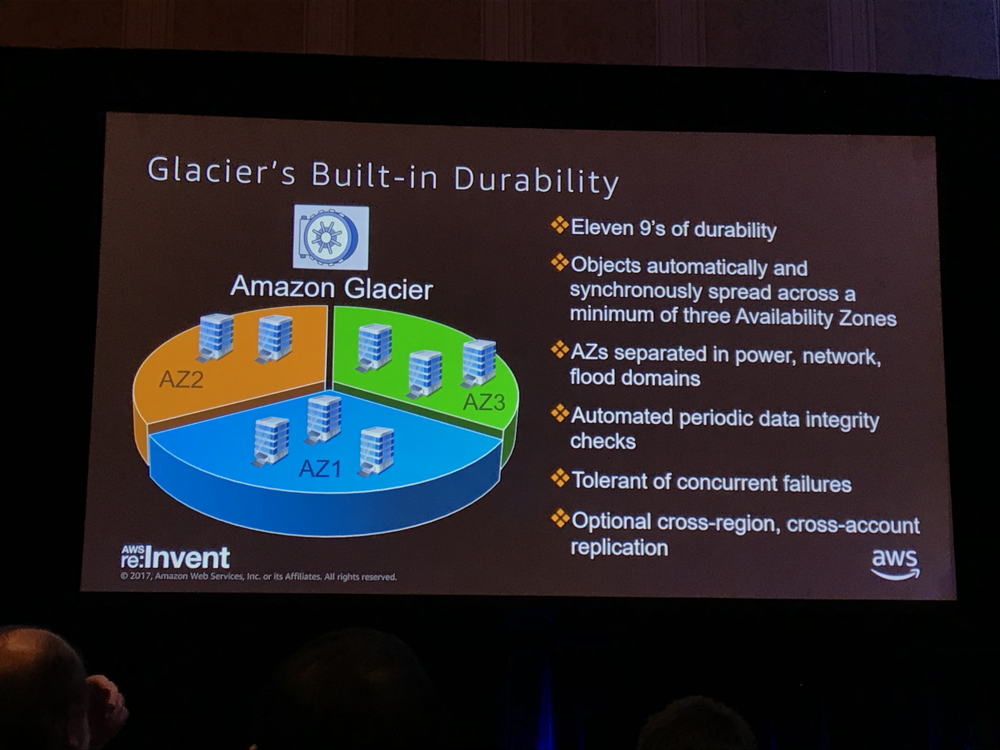

# Monday November 27, 2017

## Best Practices for Building Serverless Big Data Applications
**Ben Snively, Solutions Architect Data and Analytics**

### Overview
**Serverless characteristics**
- charged for execution time (never paying for idle)
- no servers to provision or manage
- scales with usage
- don't worry about availability and fault tolerance

**Lambda**
- Triggered through API or state changes in your setup
- Scales automatically to match the incoming event rate
- event processing, notification, processing, enrichment

**Amazon Athena**
- Query directly from Amazon S3 (using ANSI SQL)
- Serverless

**AWS Glue**
- Two major services: (1) Serverless catalog and (2) ETL/ELT service
- Uses pyspark under the covers

**Amazon Kinesis**
- Amazon Kinesis Streams: build your own custom applciations that process or analyze streaming data
- Amazon Kinesis Firehose: Easily load massive volumes of streaming data into S3, Amazon Redshift, Amazon Elastic Search

### Components of a Big Data Application

1) Ingest and Store
- Amazon Kinesis + S3

2) Prepare and Transform
- AWS Lambda: write transformation code
- AWS Glue: right choice for larger data

3) Kinesis Analytics
- Amazon Athena: SQL on S3 data
- Kinesis Analytics: SQL on data streams

4) Amazon Quicksight
- Access & User interface, visualizations etc.

5) Glue Data Catalog
- Sits on top of everything


### Example - Chat Application Message Streaming
- **Objective** analyze sentiment of chat streams as they come in

- Kinesis Firehose: streams data into S3 bucket
    - I think it can react to PUT requests?
- Lambda pre-processing: define a function to process data (i.e. calculate sentiment scores etc.)
    - This is configured withing the Kinesis set up
    - Runs before the kinesis analytics SQL query runs
- Kinesis Analytics: set a SQL query on your kinesis firehose streams.
    - Set the time interval for your queries (i.e. run every 30 seconds)


### Glue Data Catalog
- Crawler that can search all data under a specific IAM role (probably other options for searching as well)
- Automatically discovers JSON schemas
- Click a CSV dataset, and start querying in Athena!
- Use Glue to transform CSV to Parquet, gives much faster performance


## Serverless ETL with AWS Glue
**Mehul A.Shah, Software Manager**
- The audio for this session was crap (I was in the overflow room listening over a shitty iphone app), so I have padded these notes with snippets from the [AWS Glue page](https://aws.amazon.com/glue/faqs/)

### Overview of the Service


- Straight from the [AWS site](https://aws.amazon.com/glue/faqs/)
    - 1) automatically discovers and profiles your data via the Glue Data Catalog
    - 2) recommends and generates ETL code to transform your source data into target schemas
    - 3) runs the ETL jobs on a fully managed, scale-out Apache Spark environment to load your data into its destination
- Supports PostgreSQL databases running on RDS
- **Question** they emphasize using Glue for batch jobs - why wouldn't Lambda scale to do this?
    - maybe cause it's built on top of spark it's better suited?

### Example Use Cases
- build a data lake on Amazon S3
- load data to warehouse

### 4 Steps to Build an ETL Pipeline


1) **Crawl** and catalogue your data
- automatically discovers "schemas"
    - pretty cool for highly nested JSON structures, goes into each nested struct and determines schema

2) **Specify mappings** to generate scripts
- you decide which source columns map to target columns

3) **Interactively edit and explore** with **dev-endpoints**
  - Glue automatically generates Python code for your ETL jobs that you can further customize using tools you are already familiar with
  - can edit the code in the console
  - can connect your IDE to an AWS Glue development endpoint
  - can also connection notebooks (e.g. Zeppelin) to interactively experiment and explore datasets and data sources
      - can use spark SQL on our data


4) **Schedule a job** for running in production
- trigger a job based on a # of different conditions
   - can use a cron expression OR run on demand
   - can run based on completion of another job
      - allows you to set up more complicated pipelines
- pass parameters (along with triggers)


**Apache Spark and AWS Glue ETL**

- fault tolerance built-in means things will automatically get restarted
- AWS Glue was built on top of Spark?
- Created a new data structure called dynamic frames
    - no up front schema is needed
    - handle deeply nested structures
- What can you do with Dynamic Frames?
    - `ResolveChoice()` --> choose type
    - `ApplyMapping()` --> apply a mapping to structure or semi-structure mapping
    - `Relationalize()`


- Performance: on average, AWS Glue gives a 2x performance improvement over Spark DataFrames

## Expo in the Quad
- CrowdFlower: mechanical turk for enterprises
    - apparent advantages
- Two japanese guys
    - Had a sample IOT image recognition architecture
    - Used pre-built model (apparently lots of these are available)
    - Raspberry Pi --> Jetson (which was running Greenbelt (some AWS IOT service??) & Lambda)


## Serverless Data Prep with AWS Glue
**Roy Hasson**

### AWS Glue - Overview

**YAGO (Yet Another Glue Overview)**


**Workshop Examples**
1) Web scraping - Automate a process to scrape forum comments to analyze customer experience and challenges with a product
2) Venue ratings - build graph representation of users, venues and ratings
- consume a collection of venue checkins and ratings
- map users to venues
- map venues to rating

[Workshop Hyperlink](http://workshop-public.s3-website-us-east-1.amazonaws.com/)

**Recapping Thoughts**
- data catalog is pretty powerful
   - Outstanding question: how does it perform on an S3 path that is full of mixed datasets?
- Follows the same workflow as Spark, but with their Dynamic Frame objects

# Tuesday November 28, 2017

## Building Microservices on AWS
**Sam Newman**
- [Building Microservices by Sam Newman](http://shop.oreilly.com/product/0636920033158.do)

### Microservices Overview
- **independently deployable services** that **work together**, modelled around a **business domain**
    - independent deployability is the most important part of this architecture


- service oriented architecture at the bottom (which is funny, because a microservice is a SOA)

"No, communication is terrible!" - Jeff Bezos

- When you have 100s to 1000s of people trying to communicate around the same thing, it's a nightmare. Communication slows everything down.
- Find the sweet spot with a small team that can effectively communicate

- Steve Yegge's Google platforms rant
    - https://plus.google.com/+RipRowan/posts/eVeouesvaVX
    - https://plus.google.com/110981030061712822816/posts/AaygmbzVeRq
    - All teams will henceforth expose their data and functionality through service interfaces

- Microservices are an architecture which optimize for autonomy
    - Teams want autonomy through self-service
    - Higher-order abstractions over infrastructure
        - Amazon wanted more autonomy with their teams, which resulted in them building more services that would allow this (hence, AWS was born)

- AWS Elastic Beanstalk
    - manage your applications
    - choose where and how many containers you deploy in each environment (see picture below)


- Amazon ECS
    - Think Amazon's version of Kubernetes
    - Amazon Container Registry
        - where you store your docker images
    - IAM Control
        - who has access to what
    - Auto scaling
    - Service abstraction
        - Think Beanstalk for containers
    - Placement strategies
        - how are you containers distributed
        - a spread strategy could say distribute these 10 containers evenly across all nodes
    - Health checking

- Kubernetes
    - made by Google

"The phrase 'serverless' doesn't mean servers are no longer involved. It simply means that developers no longer have to think that much about them" - Ken Fromm
[source] (https://readwrite.com/2012/10/15/why-the-future-of-software-and-apps-is-serverless/)

**Lambda Example Microservice**
- when designing microservices, all parts of the stack should be elastic


- in this picture, he previously showed a single DB/RDS
- there was a media company who had this exact issue: their functions were scaling but the DB became the bottleneck. Enter DynamoDB.


## Deep Dive on Amazon Relational Database Service
**Lawrence Webley, Brian Welcker: Principal Product Manager - Amazon RDS**

**Why use Amazon RDS?**
- lower TCO because they manage "the muck"

**Which instance type should I choose?**

- make sure you monitor credits in T2 family
    - use cloudwatch

**Which storage type should I choose?**

- make sure you monitor credits with GP2

**How do I scale my database instance?**
- Scale compute/memory vertically up or down
  - can easily scale compute or memory by switching instance types
  - new host is attached to existing storage with minimal downtime

- Scale up Amazon EBS storage
  - No downtime for storage scaling
  - Amazon EBS engines now support Elastic Volumes

**Why would I use Read Replicas?**
- relieve pressure on your source database with additional read capacity
    - good for db's where bulk of the operations are read over write
- bring data close to your applications in different regions
- promote a read replica to a master for faster recovery in the event of a disaster
- read replicas can be updated independently from the source database

**When should I use Multi-AZ as opposed to Read Replicas**


**How does Amazon RDS manage backups?**
- Two options: automated backups and manual snapshots
    - backups leverage Amazon EBS snapshots stored in Amazon S3
- Transaction logs are stored ever 5 minutes in S3 to support point-in-time recovery (PITR)
- No performance penalty for backups
- Snapshots can be copied across regions or shared with other accounts

**How do I restore a backup?**
- Restoring creates an entirely new database instance
- New volumes are hydrated from Amazon S3
    - to speed up, maximize IO prior to the restore

**How do I secure my Amazon RDS database?**
- designed to be secure by default
- network isolated with Amazon VPC
- IAM based resource-level permission controls
- Encryption at rest using KWS

**What does Amazon VPC provide?**
- Places your instance in a private subnet, making it secure from public routes on the internet
- Database instance IP firewall protection lets you securely control network configuration

**How do I improve database performance?**
- Amazon RDS performance insights (really cool...)
  - Currently available for Aurora, coming soon for EBS based dbs


**Can I know when service events happen?**
- Amazon RDS uses Amazon SNS to receive notification when an event occurs

**Maintenance and billing for Amazon RDS**
Maintenance:
- Any maintenance that causes downtime (typically only a few times per year) will be scheduled in your maintenance window
    - View upcoming maintenance events in your AWS Personal Health Dashboard
- OS or software patches are usually performed without restarting databases
- Database engine upgrades require downtime

Billing:
- Database instance (instance hours)
  - combination of region + instance type + database engine + license (optional)
- Database storage (GB-mo)
- Backup storage (GB-mo)
  - size of backups and snapshots stored in Amazon S3
  - no charge for backup storage up to 100% of total database storage
- Data transfer
  - uses AWS regional data-transfer pricing
  - within the AZ does not count as data-transfer
- Use AWS cost Explorer for graphical comparison
- Use the AWS Cost & Usage report for billing details
  - must be enabled for account
  - stored in your amazon S3 bucket
- You can stop your instance from running to save costs, only pay for storage while it is stopped

## Getting Started with Docker on AWS
- Docker is an open source platform for running distributed applications
- Containers are built from a series of instructions called a Dockerfile (think: a series of instructions)
`$ docker build -t app`
`$ docker run app`

- Amazon ECS eliminates the need to install, operate, and scale your own container management system
  - Cluster management: manage pool of resources (i.e. bunch of EC2 instances)
  - Container orchestration
  - Deep AWS integration: Use other AWS sources: EC2 autoscaling groups, Route 53, Cloudwatch

- Key ECS Definitions:
  - **Instances**: standard EC2 boxes, once registered to a cluster, your tasks run here
  - **Cluster** a logical grouping of container instances that you can place tasks on
  - **Task**: a container wrapper and configuration around a process running on the instance
    - A **task definition** controls things like container image, environment variables, resource allocation, logger, and other parameters
    - Think of task as your container(s) + compute resources
  - **Service**: a layer that manages and places your tasks
    - A **service** controls things like the number of copies of a task you want running (desired count), and registers your service with a load balancer
    - from [stack overflow](https://stackoverflow.com/questions/42960678/aws-ecs-running-task-vs-service): a **service** is used to guarantee that you always have some number of **tasks** running at all times

**Getting started with ECS**
1) Create cluster
2) Task definitions in ECS
- After creating your cluster, you need to create your first task definition. Task definitions control almost everything about your service, from the container image used to your resource allocation
3) Use your task to create a service

ALB: application load balancer

Future work: I'm gonna try out this [tutorial](https://docker-curriculum.com/), cause I've never used Docker and it seems sweet!

# Wednesday November 29, 2017

## Technology Trends in Data Processing
**Anurag Gupta**

Agenda:
- Managing explosion of data
- Serverless, API-centric computing
- Global users, local access experience

**Managing Data Explosion with Data Lakes**
- machine-generated data is growing **10x faster** than business data
- micro-services architecture increases need for real-time monitoring and analytics


- data lakes allow for open data format and reduce the "gravity" of data (data in traditional warehouses has a lot of "gravity" since a large effort is required to move/transform it)


**AWS Glue**
- automatically discovers data and stores schema
- data is searchable and available for ETL
- Generates customizable code
- Schedules and runs your ETL jobs


- AWS crawler can incorporate bucket metadata (i.e. folder names) to infer schema


**Amazon Athena**
- interactive query service to analyze data in Amazon S3 using standard SQL
- no infrastructure to set up or manage and no data to load
- ability to run SQL queries on data archived in Amazon Glacier (coming soon)
- Pay per query (pay only for queries run)

# Thursday November 30, 2017

## Real-Time Anomaly Detection Using Kinesis
**Allan MacInnis & Ryan Nienhuis**

Three services:

1) Amazon Kinesis Data Streams
- capture and process streaming data
- many options to get data into the stream & read it from the stream

- running custom code on EC2 is the most popular option

2) Amazon Kinesis Data Analytics
- process and analyze streaming data with standard SQL
- great for aggregating statistics over time
  - i.e. API calls in the last 5 minutes
- many use cases in operations monitoring
- apparently you can call models from here? pre-built only?


3) Amazon Kinesis Data Firehose
- load streaming data into AWS


- key feature: buffers incoming streaming data to a certain size or for a certain period of time before delivering it to destinations
  - this is much more efficient than continuously writing every record as it arrives


Amazon Kinesis benefits and CloudWatch Logs Subscription:
- Use Kinesis Firehose to persist log data to another durable storage location: Amazon S3, Amazon Redshift etc.
- Use Kinesis Analytics to perform near real-time streaming analytics on your log data:
  - Anomaly detection
  - Aggregation
- Use Kinesis Streams with a custom stream processing application to apply business logic to your log data:
  - Alternate data destinations
  - Data enrichment


Anomaly Detection Model:

- Built into a customer SQL function `RANDOM_CUT_FOREST` [reference](http://docs.aws.amazon.com/kinesisanalytics/latest/sqlref/sqlrf-random-cut-forest.html)
- Parameters:
  - shingle size: window you want to look at
  - time decay: when do you start discounting data that arrived later
  - see docs for other parameters

- The algorithm does need some warm-up time, varies by use case

Q&A:

- Kinesis streams does not auto-scale, you must configure how many streams you want etc.
- Firehose autoscales completely
- One of the most common faults on the streams is malformed data
  - Kinesis analytics detects the schema (basically creates/continuously updates a table)
  - Apparently there is some error stream
    - more info [here](http://docs.aws.amazon.com/kinesisanalytics/latest/dev/error-handling.html)
- With lambda it's very important to ensure your function covers ALL test cases and won't error out
  - Apparently your streams get clogged when this is not done correctly (bad record keeps getting sent?)

- When to use firehose versus streams:
  - Use streams when you want to perform analysis or do transformations
  - Firehose is strictly for batch/bulk loading of data streams
    - Only analysis you can do on firehose is with Kinesis Analytics, you can flow data to EC2/Lambda with firehose

[Additional info](https://www.sumologic.com/blog/devops/kinesis-streams-vs-firehose/)

## Deep Dive on Amazon Glacier
**Mas Kubo - Senior Product Manager**

#### Data Building Blocks


Good reading on the differences between these services [here](https://www.cloudberrylab.com/blog/amazon-s3-vs-amazon-ebs/)

#### Benefits of S3 & Glacier
- durable, available & scalable
  - data is automatically distributed across three geographically distinct regions
- Amazon let's you query S3 with Athena  

#### Pricing Comparison

- glacier launched at $0.01/GB, and has been decreasing at ~19% per year
- S3-IA stands for S3 infrequent access

#### Lifecycle Policies
- automatically move from S3 to Glacier with bucket lifecycle policies
- you can have the policy apply to the whole bucket, or using tagging/prefix filtering for specific objects


#### Storage Class Analysis
- automatically analyzes your storage patterns and give you recommendations for moving based on access patterns
-

#### Pro Tips

- Moving specific objects to Glacier:
  - Set a zero-day lifecycle policy for objects with a specific tag
  - Have an API call that updates an object's tag to the one set above
- Use MultiUpload for uploading to glacier


#### How Glacier Achieves all the 9's of availability

- youtube "reinvent James Hamilton 1026" to learn about how they achieve this

#### AWS Snow Family
- Snowball: petabyte-scale data migration
- Snowball Edge: compute and storage for hybrid/edge workloads
- Snowmobile: exabyte-scale data migration


#### Amazon Glacier Vaults
- You can set irreversible constraints, like don't let anyone delete archive for 365 days
  - This is important for compliance
  - Can also do more complex policies

#### Flexible Data Retrieval Options
- three retrieval options
- Expedited: rare urgent access, 1-5 minutes, $0.03/GB
- Standard: current model, 3-5 hours, $0.01/GB
- Bulk: Batch/bulk, <10 hours, $0.025/GB

#### Glacier Select
- new service just announced; allows you to query glacier data with SQL
- Timeline: Send a select post request --> Get a 200 response --> AWS will execute query --> Retrieved object is written to S3
- Should cost less because you are retrieving less data

## Serverless Architectural Patterns and Best Practices
**Drew Dennis & Maitreya Ranganath**

Serverless mean's:
1) No servers to provision or manage
2) Scales with usage
3) Never pay for idle
4) Built-in High-Availability and Disaster Recovery

### Lambda considerations & best practices:
- Can your Lambda functions survive the cold?
  - instantiate AWS clients and database clients outside the scope of the handler to take advance of container re-use
  - Schedule with CloudWatch Events for warmth
```python
# executes during cold start
import sys
import logging
import rds_config
import pymysql

rds_host = 'rds-instance'
db_name = rds_config.db_name

try:
  conn = pymysql.connect()
except:
  logger.error('ERROR')

## executes with each invocation
def handler(event, context):
  with conn.cursor() as cur:
    # do stuff
```

- Minimize package size to necessities
- Separate the lambda handler from core logic
- Use Environment variables to modify operational behaviour
  - encryption options available for security
- Self-contain dependencies in your function package
- Leverage "Max Memory Used" to right-size your functions
  - Note: more resources will improve your cold-start times

### AWS X-ray Integration with Serverless
- lambda instruments incoming requests for all supported languages
- lambda runs the X-ray daemon on all languages with an SDK

X-ray trace diagram helps you diagnose things:


  - gap between initialization and S3 is a measure of your cold start time

### AWS Serverless Application Model (SAM)
- CloudFormation extension optimized for serverless
- New serverless resource types: functions, APIs, and tables
- Just announced Cloud9 which gives you an IDE in the Lambda console

### Architechures


#### Web App
**Structure**

- cognito provides sign-in/sign-up for your application
- company named Bustle achieved 84% cost savings with AWS lambda

**Security**


  - can also have a lambda function that performs user validation
    - I think he said it must return an IAM role??

**Useful Frameworks for Serverless Web Apps**
- [AWS Chalice](https://github.com/aws/chalice)
  - similar to Flask/Bottle

#### Data Lake


**S3 Foundation**
- multiple storage classes
- versioning & encryption
- object tagging for metadata info

**Search and Data Catalog**
Options:
- Trigger lambda function that does tagging in response to S3 object arrival --> store metadata in DynamoDB
- Use an AWS Glue crawler

**Analtyics & Procesing**
- Athena to query the lake
  - charges based on the data scanned
- Athena best practices
  - partition data
    - `s3://bucket/flight/parquet/year=1991/month=1/day=2/`
  - columnar formats (apache parquet, AVRO, ORC)
- [Pywren Python library](http://pywren.io/)

#### Stream Processing

**Characteristics**
- high ingest rate and spiky traffic
- message durability and ordering
- objective: get your insights right away


**Best Practices**
- Tune Firehose **buffer size** and **buffer interval**
  - Larger objects = fewer Lambda invocations, fewer S3 PUTs
- Enable **compression** to reduce storage costs

- Number of Amazon Kinesis Streams **shards** corresponds to **concurrent invocations** of a Lambda function
  - Messages are sent in order to the lambda function
  - Have to process every message in order to keep up
- **Batch size** sets maximum number of records per Lambda function invocation

- Fan-out pattern trades strict message ordering vs higher throughput & lower latency


- Tune **batch size** when lambda is triggered by Amazon Kinesis Streams
- Tune **memory** setting for your lambda function
  - Higher memory = shorter execution time
- Use Kinesis Producer Library (KPL) to batch messages and saturate Amazon Kinesis stream capacity

**Comparing Related Services**
- SNS and SQS are other related services
- Kinesis streams guarantees message ordering within streams
  - With SNS, no guarantee with order
  - Kinesis lets you iterate forwards and backwards within the message stream


# Hand's On Labs
The Hand's On labs were on of my favourite parts of the conference. They gave us free access to everything available on [Qwik Labs](https://qwiklabs.com/), which gives you hands on tutorials to using the AWS suite. You can to play within the AWS console without worrying about billing, etc.

The room for this was hilarious, so I had to take a picture:


## AWS Identity and Access Management (IAM)
I always get these mixed up, so capturing my notes & thoughts here:

**Users**
- unique identity recognized by AWS services and applications
- can login with username/password
- can be enabled to access via SSH

**Groups**
- a collection of IAM users

**Roles**
- an IAM role is similar to a User, in that it is an AWS identity with permission policies that determine what the identity can and cannot do in AWS
- a role defines a set of permissions

**Policies**
- policies dictate what permissions a user/identity will have
- Three types:
  - **managed policy**: is a standalone policy that is created and administered by AWS. you cannot edit it! they are accessible across multiple AWS accounts
  - **customer managed policy**: you create/manage it..
  - **inline policy**: a policy that's embedded in a principal entity (a user, group, or role)—that is, the policy is an inherent part of the principal entity
    - useful if you want to maintain a strict one-to-one relationship between a policy and the principal entity that it's applied to

[reference](https://aws.amazon.com/iam/faqs/)

## Introduction to Lambda
Lot's of good stuff [here](http://docs.aws.amazon.com/lambda/latest/dg/python-programming-model-handler-types.html)

Interesting convo with one of the experts:
- Stale lambda functions need some "warm-up" time
  - i.e. if you haven't pinged a lambda function in a while, the next time you hit it will have a longer response time
- common strategies around this including periodically pinging the lambda function at regular intervals
  - really depends on your application and the response time you need

## Introduction to Amazon API Gateway
- create, deploy and maintain APIs

API Gateway Features:
- Transform body and headers of incoming/outgoing requests to match backend/frontend systems
- Control API access with IAM

Key Terminology:

- **Resource**: represented as a URL endpoint and path (i.e. api.mysite.com/questions)
- **Method**: combination of a resource path and an HTTP verb `GET`, `POST`, `DELETE` etc.
- **Method Request**: settings in API gateway store the methods authorization settings and define the query string parameters and request headers
- **Integration Request**: settings that define the backend target used with the method. This is where you define mapping templates to transform the incoming request to match what the backend target is expecting
- **Integration Response**: mappings defined between the response from the backend target and the method response in API gateway
- **Method Response**: define the method response types, their headers and content types
- **Model**: in API gateway, a model define the format (i.e. scheme) of some data. Models are created along with mapping templates used in integration request/response
- **Stage**: in API gateway, this defines the path through which an API deployment is accessible
- **Blueprint**: A lambda blueprint is an example lambda function that can be used as a base to build out new Lambda functions
